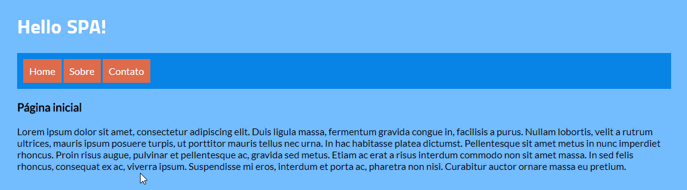

# Iniciando com Vue.js

## O que vamos aprender

 - Iniciar um projeto sem usar Vue Cli
 - O que é um SPA na prática
 - O que são componentes
 - v-if versus v-show
 - Navegação com Vue Router
 - Iniciar um projeto com Vue Cli

## Material de apoio

 - [https://vuejs.org/](https://vuejs.org/)
 - [https://router.vuejs.org/](https://router.vuejs.org/)
 - [https://cli.vuejs.org/](https://cli.vuejs.org/)

## Precisa de um plano de estudos?

[https://www.schoolofnet.com/plano-de-estudo-desenvolvedor-vuejs/](https://www.schoolofnet.com/plano-de-estudo-desenvolvedor-vuejs/)
